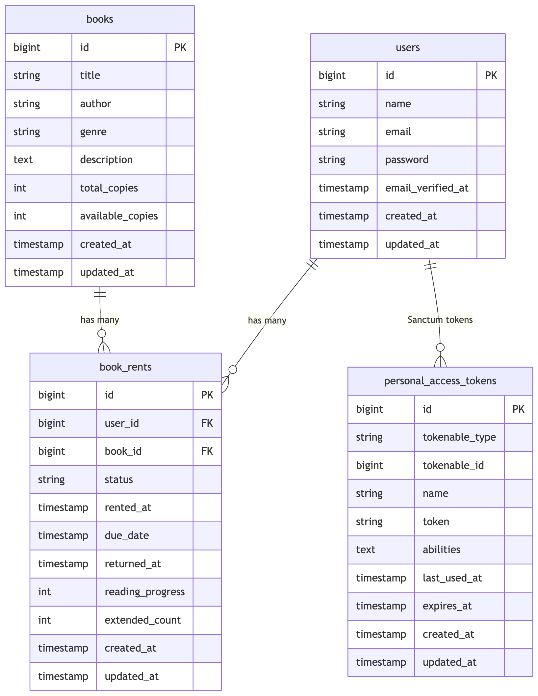
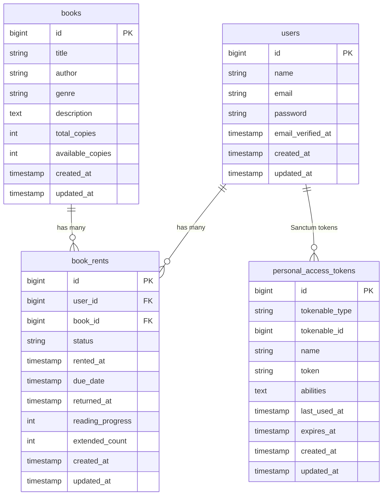

# Database diagram (Library API)

Simple view of **domain tables** and how they relate. Laravel/Sanctum framework tables (`sessions`, `cache`, `jobs`, …) are omitted unless noted.

## ER diagram

Rendered export (PNG):

Editable source (Mermaid):

## Referential actions

| From | To | On delete |
|------|-----|-----------|
| `book_rents.user_id` | `users.id` | **RESTRICT** |
| `book_rents.book_id` | `books.id` | **CASCADE** |

## Other constraints

- **`users.email`** — unique (see migration).

## PostgreSQL-only checks (see migrations)

On **`books`:** `total_copies >= 0`, `available_copies >= 0`, `available_copies <= total_copies`.

On **`book_rents`:** `reading_progress` in **0–100**, `extended_count >= 0`.

SQLite in CI relies on application validation instead of these `CHECK` constraints.
